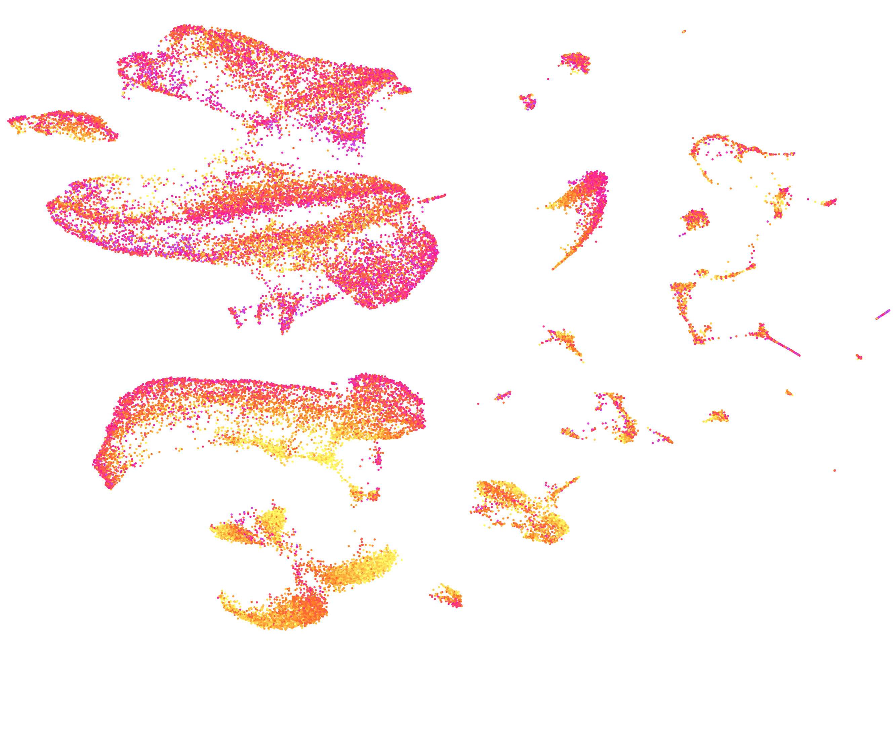

# 
  

## Introduction

**scrnaseq2** is a bioinformatics workflow to analyze single-cell data, and it is written by the bioinformatics team of the DRESDEN-concept Genome Center. 

The workflow is written in R  and is largely based on the [Seurat v5](https://satijalab.org/seurat/) R package. It follows [best practices recommendations](https://www.nature.com/articles/s41576-023-00586-w) and contains additional visualisations, tables and documentation for a better understanding. The workflow supports RNA sequencing data from one or more samples processed with 10X Genomics, SmartSeq, Parse Biosciences and Scale Bio. 

## Documentation 

https://dcgc-bfx.github.io/scrnaseq2_doc/

## Credits

The workflow is being written by [Katrin Sameith](https://github.com/ktrns), [Andreas Petzold](https://github.com/andpet0101) and [Rajinder Gupta](https://github.com/rajinder4489) at the [DRESDEN-concept Genome Center](https://genomecenter.tu-dresden.de/about-us). **scrnaseq2** is based on [scrnaseq](https://github.com/ktrns/scrnaseq). 

## Contributions and Support

If you would like to contribute to this workflow, please first create your own fork of the GitHub repository. You can then work on your fork, and once your code is finalized and working, you can create a pull request. 

## Citation

If you used **scrnaseq2** to analyze your data, please cite it by mentioning the DRESDEN-concept Genome Center URL "https://genomecenter.tu-dresden.de". 

(todo: Zenodo)
